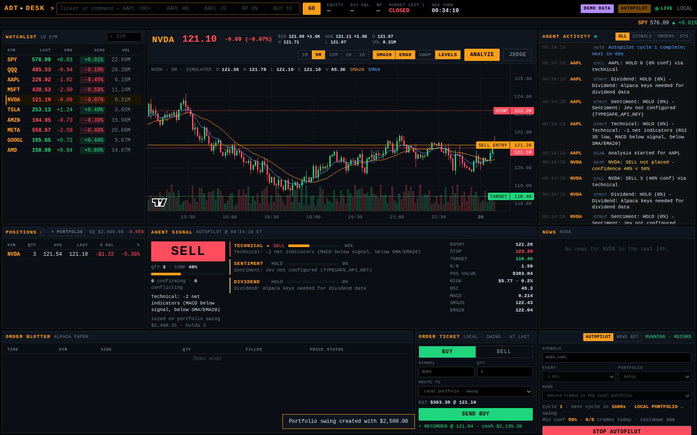

# AI Day Trader

An intraday trading assistant built on Claude Code. Claude does the analysis and
operates your Robinhood account through Robinhood's MCP tools; this repository adds
what those tools do not provide:

- **An order guard** that Claude cannot skip. A Claude Code hook checks every Robinhood
  order against hard limits before it reaches the permission prompt, and blocks all
  orders while the project is in review-only mode.
- **Jev news judgments.** Each headline is scored by TypeSafe's Jev model for relevance,
  direction, materiality and event type, then aggregated with recency weighting.
- **A trade journal** that records every decision (including passes) with its thesis and
  entry price, then scores it against the day's close, so you can see whether the
  strategy works before risking money.
- **A playbook** (`.claude/skills/day-trader`) that tells Claude how to analyze, size,
  review and journal a trade.
- **A news bot** (`trader.newsbot`) that trades Alpaca's news stream on its own: Jev
  judges each headline, rules in code decide, and a bracket order (entry, stop, target)
  goes in with no approval step. Paper by default; real money only if you opt in
  (see [Real money](#real-money-alpaca-live)).
- **A live desk** (`trader.desk`) that shows all of it as it happens, runs the
  technical + sentiment + dividend analysis on demand, switches the desk autopilot and
  the news bot's trading on and off, and keeps local paper portfolios.

The previous standalone version (multi-provider data fetching, the original FastAPI
server) is preserved under the `v1-legacy` tag.

## How it fits together

```
you ──► Claude Code ──► Robinhood MCP tools (quotes, indicators, account, orders)
             │               ▲
             │               └── .claude/hooks/order_guard.sh ─► trader.guard
             │                   (runs before every order; fails closed)
             ├──► python -m trader.scan    (candidates: Alpaca movers + Jev triage)
             ├──  python -m trader.newsbot (on its own: Alpaca news ─► Jev ─► paper bracket orders)
             ├──► python -m trader.news    (Jev headline judgments)
             ├──► python -m trader.sizing  (quantity and stop from account figures)
             └──► python -m trader.journal (decisions, outcomes, hit rate)

browser ──► python -m trader.desk ──► live view of all of the above: quotes and charts,
                                      the bot's signals/orders, Claude's decisions, guard
                                      reviews, the Alpaca paper account; ANALYZE and JUDGE;
                                      the desk autopilot (on/off); local paper portfolios;
                                      manual ticket
```

## Setup

```bash
git clone https://github.com/Ap6pack/ai-day-trader-agent.git
cd ai-day-trader-agent
python3 -m venv .venv && source .venv/bin/activate
pip install -r requirements.txt
cp .env.example .env    # then add your keys; leave TRADER_MODE=review
```

Start Claude Code in the project directory (`claude`). When it asks about the
`robinhood-trading` MCP server from `.mcp.json`, enable it for this project and sign in
to Robinhood. Order placement needs a Robinhood account with agentic trading enabled.

Check the setup without exposing secrets:

```bash
python -m trader.status
```

Then ask Claude, for example: *"Scan my watchlist for day-trade setups"* or
*"Analyze NVDA for a day trade"*. The day-trader skill guides the rest.

## Review-only mode first

`TRADER_MODE=review` is the default. In this mode the guard blocks every
`place_*_order` call; Claude reviews the order with `review_equity_order` and records
what it would have done. Score those decisions each day
(`python -m trader.journal pending`, then `outcome`) and check
`python -m trader.journal summary`. Switch `.env` to `TRADER_MODE=live` yourself, and
only once the record justifies it.

## The order guard

Configured in `.claude/settings.json`; logic in `trader/guard.py`. In live mode an
order passes only if:

- it is an equity order (options and crypto are off unless enabled),
- the symbol is on `TRADER_ALLOWED_SYMBOLS` when that list is set,
- it is sizeable from its own fields (a limit or stop price with a quantity, or a
  dollar amount), and a buy is at most `TRADER_MAX_ORDER_USD`,
- fewer than `TRADER_MAX_ORDERS_PER_DAY` orders passed today, and
- the same symbol and side were reviewed within `TRADER_REVIEW_WINDOW_MINUTES`.

Passing the guard does not approve an order: Claude Code still asks you. Any error in
the guard blocks the order. The project settings also stop Claude's file tools from
reading `.env` or editing the guard's configuration.

**Limits of this protection:** hooks run only in Claude Code. Robinhood tools used from
Claude Desktop or claude.ai chat are not guarded by this project. Use Claude Code for
anything that can place an order.

## The news bot (Alpaca paper)

`python -m trader.newsbot run` streams Alpaca news, judges each headline with Jev and
applies the `NEWSBOT_*` rules in `.env`: a relevance, materiality and bullish-probability
threshold per headline, a maximum headline age, and roundups skipped. A bullish signal
becomes a market-entry bracket order with a take-profit and a stop-loss, subject to a
dollar size per trade, a daily trade cap, a per-symbol cooldown, a minimum price and no
new entries near the close. It is long only; bearish signals are journaled as `sell`
decisions so they are scored, but never shorted.

- `NEWSBOT_EXECUTION=off` (the default) journals signals without ordering. Set it to
  `paper` to trade.
- Order functions refuse to run unless `ALPACA_TRADING_BASE_URL` is
  `https://paper-api.alpaca.markets` (the default). There is no live mode.
- The Claude Code order guard does not see these orders; the limits live in the bot.
- `python -m trader.newsbot replay SYMBOL --hours 24` applies the rules to recent
  headlines, never trading or journaling, for tuning thresholds.
- `run` flattens (cancels open orders, closes every paper position)
  `NEWSBOT_FLATTEN_MINUTES` before the close, read from Alpaca's clock, so early-close
  days are covered. `python -m trader.newsbot flatten` does the same by hand or as a
  cron backup.
- The bot picks its own stocks with `NEWSBOT_SYMBOLS=auto`: every
  `NEWSBOT_UNIVERSE_REFRESH_MINUTES` it rebuilds today's in-play list from Alpaca's
  most-active stocks and top movers (above `TRADER_MIN_PRICE`) plus `TRADER_WATCHLIST`,
  and skips headlines for anything else before calling Jev. If the list cannot be loaded
  it judges nothing; a failed refresh keeps the previous list. A fixed list or empty (all
  market news, one Jev call per one- or two-ticker headline) also work.
- Its decisions share the journal with Claude's (`mode` is `newsbot-off` or
  `newsbot-paper`), and `journal summary` does not yet split them.

Suggested schedule (weekdays, `CRON_TZ=America/New_York`):

```
25 9  * * 1-5  cd /path/to/ai-day-trader-agent && timeout 7h .venv/bin/python -m trader.newsbot run >> data/newsbot.log 2>&1
50 15 * * 1-5  cd /path/to/ai-day-trader-agent && .venv/bin/python -m trader.newsbot flatten >> data/newsbot.log 2>&1
20 16 * * 1-5  cd /path/to/ai-day-trader-agent && .venv/bin/python -m trader.autopilot score >> data/autopilot.log 2>&1
40 16 * * 1-5  cd /path/to/ai-day-trader-agent && .venv/bin/python -m trader.autopilot review >> data/autopilot.log 2>&1
```

`python -m trader.autopilot cron` prints these lines with your real paths.

### Claude's daily review

After the close, `trader.autopilot` starts Claude Code unattended (`claude -p`, with
`--permission-mode dontAsk` and a short tool allowlist that never includes order placement):

- `score` fills in each pending decision's outcome from the day's close.
- `review` reads the journal and writes `data/runs/<time>-review/report.md`: signals,
  trades, hit rate and return by event type and probability bucket, latency, and proposed
  `NEWSBOT_*` changes with their evidence and sample size. It never edits `.env`; you apply
  changes you agree with.
- `run` (optional) has Claude analyze the scan shortlist in review mode.
- `check` shows the setup and the MCP server names Claude Code sees.

## Real money (Alpaca live)

Everything runs on the Alpaca **paper** account unless you opt in. To trade real money:

```bash
# .env: both are required; either one alone refuses every order
ALPACA_TRADING_BASE_URL=https://api.alpaca.markets
ALPACA_LIVE_TRADING=true
# Your LIVE account's keys (Alpaca issues separate keys for paper and live)
ALPACA_API_KEY=...
ALPACA_SECRET_KEY=...
```

Then each agent opts in on its own:

- **News bot**: `NEWSBOT_EXECUTION=live`. `paper` or `live` must match the account, or
  `run` refuses to start.
- **Desk ticket**: the desk shows a red **LIVE MONEY** badge, and every order must be
  confirmed by typing `LIVE`.
- **Desk autopilot**: the AUTOPILOT tab offers *Send LIVE orders — REAL MONEY* instead
  of paper orders, and starting it needs you to type `LIVE`. It sizes on the live
  account's equity, caps each buy at `ALPACA_LIVE_MAX_ORDER_USD`, only sells shares it
  bought itself, and closes its own positions `AUTOPILOT_FLATTEN_MINUTES` before the
  close (as it now does in paper mode too).

Hard limits on every live buy, checked in `trader.alpaca` at the moment of sending, so
no agent can skip them: `ALPACA_LIVE_MAX_ORDER_USD` (default $500 per order),
`ALPACA_LIVE_MAX_ORDERS_PER_DAY` (default 3) and `ALPACA_LIVE_MAX_DAILY_LOSS_USD`
(default $200; new buys stop for the day once the account is down that much). Sells
are never blocked, so you can always get out.

Your own holdings are safe: on a live account the news bot and the autopilot only sell
and flatten shares they bought that day (tracked by their order ids), never positions
you already hold, and "close every position" is paper only.

Start small, watch the desk, and run `python -m trader.newsbot replay SYMBOL` on recent
headlines first. Robinhood real-money trading is separate: it goes through Claude Code
with `TRADER_MODE=live` and the order guard (see above).

## Live trading desk



```bash
python -m trader.desk          # then open http://127.0.0.1:8000/desk
```

The desk is the window onto the agents, and lets you switch the automation on and off.
Everything streams live:

- **Agent activity**: every headline the news bot judged (with Jev's probabilities and
  latency, and why it traded or passed), its bracket orders and the end-of-day flatten,
  every step of the desk autopilot (each strategy's signal, the call, orders and why an
  order was skipped), Claude's decisions and the order guard's reviews.
- **Agent signal**: the latest call on the loaded symbol, with entry, stop and target
  drawn on the chart.
  - **ANALYZE** (or `SYM AN`): the multi-strategy view. Technical (RSI, MACD, price
    against SMA20/EMA20), Jev sentiment on recent headlines and dividend capture are
    combined into BUY / SELL / HOLD with a confidence, then sized: quantity, ATR stop
    and target, risk/reward, position value and the dollars and percent at risk. It is
    sized on where the ticket routes (a local portfolio or the Alpaca paper account).
  - **JUDGE** (or `SYM JG`): Jev judges the symbol's recent headlines with the news
    bot's own rules, so you see what the bot would decide.
- **AUTOPILOT tab**: start and stop hands-off trading from the desk. Pick the symbols
  (the watchlist by default), how often (1 min to 1 hr) and the mode: *signals only*,
  *record trades in a local portfolio*, or *send Alpaca paper orders* (bracket buys with
  the analysis's stop and target, market sells of held shares; long only). Limits from
  `AUTOPILOT_*` apply before every trade: minimum confidence, daily cap, per-symbol
  cooldown, minimum price and no entries near the close. `AP ON` / `AP OFF` also work.
- **NEWS BOT tab**: mode, today's stocks, trades against the daily cap, latency and
  rules, and a **PAUSE / RESUME** switch. Paused, the bot keeps judging and journaling
  headlines but places no orders. The bot itself runs on its own; change its rules in
  `.env`.
- **Local paper portfolios**: simulated accounts with cash, holdings and P&L, kept in the
  journal database. Create as many as you like (**+ PORTFOLIO**, or
  `python -m trader.portfolios create NAME --cash 10000`) to compare approaches, view one
  in POSITIONS, route the ticket to it, or have the autopilot record into it.
- **Market and account**: watchlist, ticker tape and candlestick chart (Alpaca, or
  `DESK_DEMO_MODE=true` for simulated data), news, and the Alpaca paper account's
  equity, positions and orders (tagged bot, autopilot or manual).
- **Manual ticket**: market orders to the Alpaca paper account, or a fill recorded at the
  last price in a local portfolio. Manual orders are journaled as desk orders, so the
  daily review can tell them apart from the agents'.

It binds to `127.0.0.1`. To open it from another machine set `DESK_TOKEN` and
`DESK_HOST`; the desk refuses a non-local bind without a token.

## Commands

| Command | Purpose |
|---|---|
| `python -m trader.status` | Mode, limits, credential status |
| `python -m trader.scan [--all]` | Today's candidates: watchlist + Alpaca most-active and movers, ranked with Jev (material news first) |
| `python -m trader.news SYMBOL [--json] [--sample]` | Jev judgments of recent headlines |
| `python -m trader.sizing --symbol S --side buy --price P --equity E [...]` | Max quantity and stop-loss |
| `python -m trader.journal decide ...` / `list` / `events` / `pending` / `outcome` / `summary` | Journal |
| `python -m trader.newsbot run` / `replay SYMBOL [--hours H]` / `flatten` | Autonomous Alpaca paper news bot |
| `python -m trader.autopilot score` / `review` / `run` / `check` / `cron` | Claude's scheduled runs |
| `python -m trader.desk` | Live trading desk at http://127.0.0.1:8000/desk |
| `python -m trader.analysis SYMBOL [--capital C] [--held N]` | Technical + sentiment + dividend analysis with sizing and risk |
| `python -m trader.portfolios list` / `create NAME [--cash C]` / `show NAME` / `delete NAME` | Local paper portfolios |

## Tests

```bash
python -m pytest
```

## Plan

See [docs/PLAN.md](docs/PLAN.md) for what comes next.

## Disclaimer

Educational software. Trading involves risk of loss. You are responsible for every
order placed from your account.
